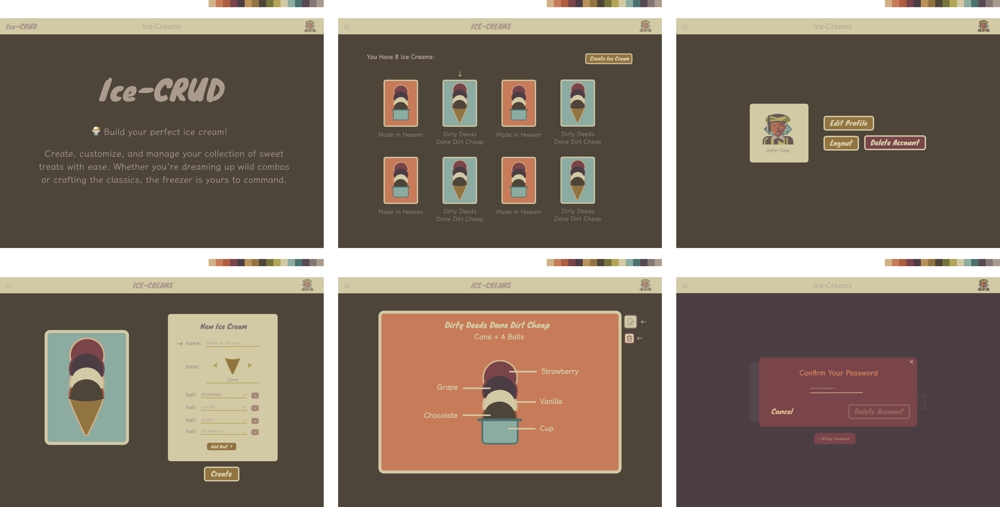

<header align="center" >
    <h1> 🍦 Ice CRUD </h1>
    
</header>

## 🤨 What is this?

**The Frontend of a Full-Stack CRUD Web App**

- Customers can create, edit, view and delete custom ice creams.
- Auth is using "Access/Refresh Token Flow"
- The goal is purely learning and improvement
- Idea, structure, and design was made by me

## 👨🏼‍💻 Main Technologies/Tools Used

**Development**
- Next.js (framework)
- TypeScript (language)
- TailwindCSS ("CSS")
- ReactHookForm (form manager)
- Zod (data validator)
- TanStack Query (query & cache manager)

**Design**
- Figma

## 🚀 Running Locally

**Requirements:**
- ➜ [Git](https://git-scm.com/)
- ➜ [Node](https://nodejs.org/en)
- ➜ [NPM](https://docs.npmjs.com/cli/v11/configuring-npm/install)

--

First, see the steps to run locally the ➜ [Backend](https://github.com/cicero-mello/ice-crud-backend).

After that:

```shell
    git clone https://github.com/cicero-mello/ice-crud-frontend.git
```
```shell
    cd ice-crud-frontend
```
```shell
    npm i
```
```shell
    npm run build
```
```shell
    npm run start
```
Finally, open ➜ [localhost:3000](http://localhost:3000/).

##

### 🤯 My notes about this project is in ➜ [**Notion**](https://vaulted-parade-385.notion.site/Ice-CRUD-1e533bf3f417804fa788c62406127d27)
